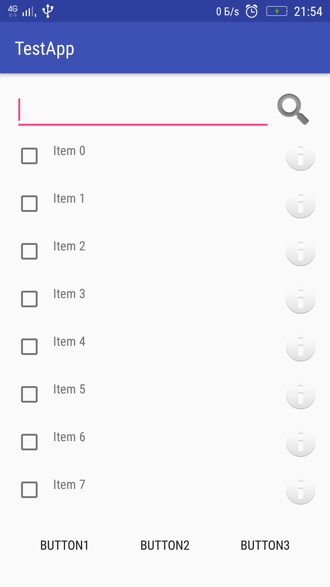

# Лабораторна робота №2 Розроблення інтерфейсу мобільного додатку

*Мета роботи*. Навчитися розробляти простий інтерфейс програми, вивчити засоби розмітки FrameLayout, LinearLayout, вивчити елементи інтерфейсу EditText, ImageView, ScrollView, Button, начитися динамічно створювати елементи інтерфейсу з файлів розмітки, обробляти події, виконувати переходи між елементами програми.

Студент розробляє програму відповідно до обраної ним теми проекту.

Приклад програми для Android із реалізацією необхідних елементів можна завантажити з використанням команди

git clone https://github.com/mdavydov/MobileLab02.git

після чого відкрити папку Android в AndroidStudio.

Хід виконання роботи:

1. Подивитися відео з поясненнями про прототипування в Sketch і використання AndroidStudio для створення інтерфейсу користувача: (https://www.youtube.com/watch?v=lUymjX4K7FM) і про використання засобів XCode (https://developer.apple.com/videos/play/wwdc2015/218/)
1. Створити нову програму в AndroidStudio.
1. Відредагувати res/layout/activity_main.xml у режимі Text
    1. Розмістити інтерфейсні елементи за допомогою вертикального і горизонтального LinearLayout (android:orientation="vertical" або android:orientation="horizontal")
    1. Створити список з використанням ScrollView
    1. Розмістити текстові написи з використанням TextView
    1. Розмістити графічні елементи з використанням ImageView
    1. Розмістити засоби введення тексту з використанням EditText
    1. Розмістити інші елементи керування (CheckBox, Button, тощо)
    1. Визначити розміри елементів з використанням android:layout_width і android:layout_height з використанням вбудованих значень “wrap_content”, “match_parent”, з використанням констант, які додаються у файл res/values/dimens.xml, або з використанням ваг android:layout_weight
    1. Визначити написи елементів з використанням стрічок, які додаються в файл res/values/strings.xml
    1. Прописати ідентифікатори елементів android:id
    1. Створити приховані елементи, які будуть з’являтися при натиснені на інші елементи (див. LinearLayout з ідентифікатором “@+id/detail”)
    1. Можна візуально перевірити розміщення елементів з використанням режиму Design
1. Створити розміщення для елементів списку (див. файл list_item.xml)
1. Відредагувати файл MainActivity.java
    1. Реалізувати інтерфейс View.OnClickListener.
    1. Наповнити елементи списку у функції onCreate з використанням LayoutInflater, встановити текст відповідних елементів, додати обробники подій для натиcнень на елементи керування.
    1. Реалізувати обробник подій і додати анімації для елементів, які повинні з’являтися або ховатися.
1. Написати звіт 
 
Реалізація інтерфейсу View.OnClickListener:
  ```
public class MainActivity extends AppCompatActivity implements View.OnClickListener
{
    public void onClick(View v)
    {
        ...
    }
}
```

Приклад наповнення списку:
```
ViewGroup m_my_list;
@Override
protected void onCreate(Bundle savedInstanceState)
{
    super.onCreate(savedInstanceState);
    setContentView(R.layout.activity_main);
    m_my_list = (ViewGroup)findViewById(R.id.list);
    LayoutInflater l = (LayoutInflater) getSystemService(Context.LAYOUT_INFLATER_SERVICE);
    Vector<String> strings = new Vector<String>();
    for(int i=0;i<100;++i)
    {
        strings.add("Item " + i);
    }
    for(String s : strings)
    {
        View item = l.inflate( R.layout.list_item, null);
        ((TextView)item.findViewById(R.id.itemtext)).setText(s);
        item.findViewById(R.id.morebutton).setOnClickListener(this);
        m_my_list.addView(item);
    }
    findViewById(R.id.detail).setOnClickListener(this);
}
```
   
Приклад обробника подій на натиснення:
```
public void onClick(View v)
{
    if (v.getId()==R.id.morebutton)
    {
        View detailview = findViewById(R.id.detail);
        float width = findViewById(R.id.main_layout).getWidth();
        TranslateAnimation anim = new TranslateAnimation(width, 0.0f, 0.0f, 0.0f);
        anim.setDuration(300);
        anim.setFillAfter(true);
        detailview.bringToFront();
        detailview.startAnimation(anim);
        detailview.setVisibility(View.VISIBLE);
        detailview.setEnabled(true);
    }
    else if (v.getId()==R.id.detail)
    {
        View detailview = v;
        TranslateAnimation anim = new TranslateAnimation(0.0f, detailview.getWidth(), 0.0f, 0.0f);
        anim.setAnimationListener(new Animation.AnimationListener() {
            @Override
            public void onAnimationStart(Animation animation) {}
            @Override
            public void onAnimationEnd(Animation animation) {
                findViewById(R.id.listview).bringToFront();
            }
            @Override
            public void onAnimationRepeat(Animation animation) {}
        });
        anim.setDuration(300);
        anim.setFillAfter(true);
        detailview.startAnimation(anim);
        detailview.setEnabled(false);
    }
}
```


*Пояснення*

Виклик `setContentView(R.layout.activity_main)` створює елементи вікна з файлу ресурсів `res/layout/activity_main.xml`

За допомогою `m_my_list = (ViewGroup)findViewById(R.id.list)` відбувається пошук елемента інтерфейсу, до якого будуть додаватися дочірні елементи списку. Елемент приводиться до типу `ViewGroup`, щоб можна було додавати дочірні елементи (наперед відомо, що LinearLayout наслідує ViewGroup).

За допомогою `LayoutInflater l = (LayoutInflater)getSystemService(Context.LAYOUT_INFLATER_SERVICE)`
отримується системний об’єкт, який вміє створювати елементи інтерфейсу з файлу розмітки.

Виклик `View item = l.inflate( R.layout.list_item, null)` створює один елемент списку.

Виклик `((TextView)item.findViewById(R.id.itemtext)).setText(s)` встановлює текст у відповідний `TextView` елементу списку

Виклик `item.findViewById(R.id.morebutton).setOnClickListener(this)` встановлює поточний екземпляр `MainActivity` обробником подій при натисненні кнопки деталізації елемента списку.

Функція `bringToFront()` використовється для того, щоб визначити, який саме елемент інтерфейсу буде отримувати подію `onClick` в першу чергу.

Функція `setFillAfter(true)` забезпечує збереження нової позиції елемента інтерфейсу після анімації.

Фукнція `setEnabled(false)` використовується для того, щоб  елемент інтерфейсу не опрацьовував події під час анімації.

Виклик `anim.setAnimationListener(...)` встановлює обробник подій на анімацію, який ставить вікно зі списком (елемент з ідентифікатором `R.id.listview`) перед іншими вікнами (при цьому вікно з ідентифікатором `R.id.detail` ховається).

**Приклад екрану програми:**


